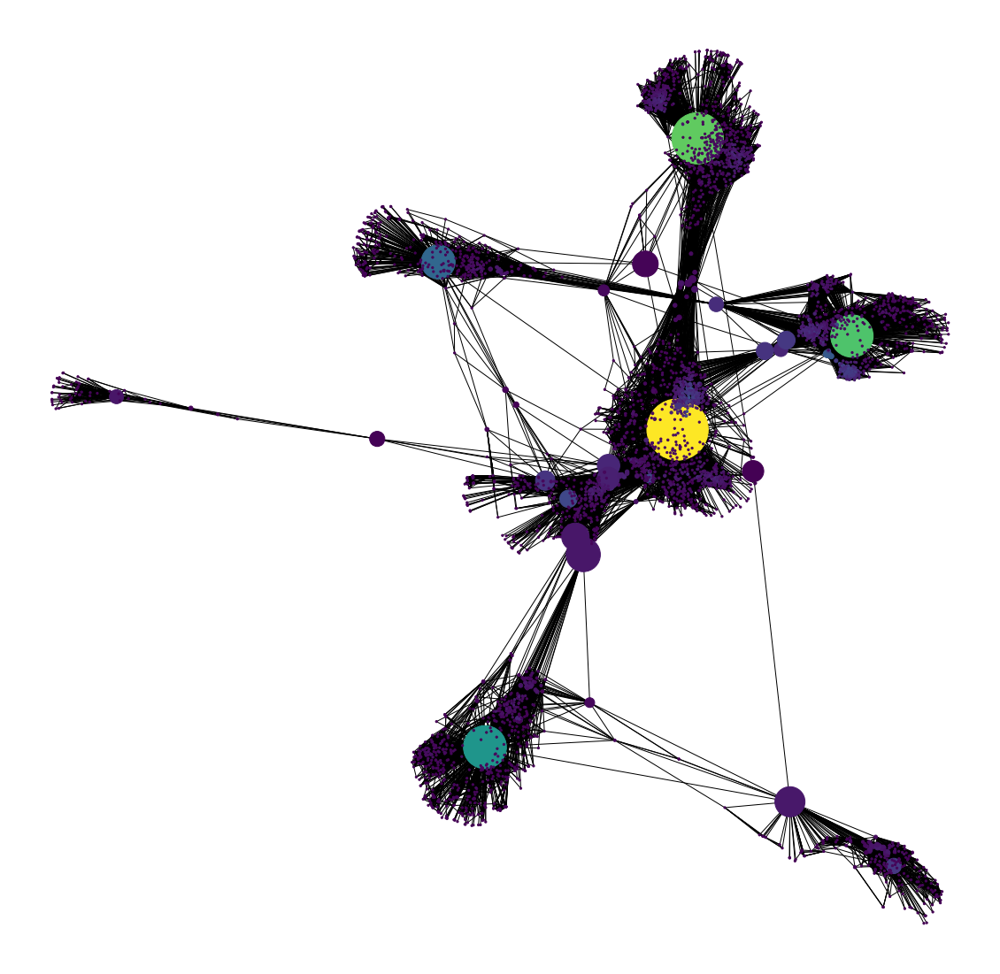

# Social Network Analysis

## TOC Project 2020

### -Aryan Ganotra (2K18/CO/096)
### -Aryan Rana (2K18/CO/097)

```python
#importing networkx
import networkx as nx
```


```python
#creating a symmetric graph
G_symmetric = nx.Graph()
G_symmetric.add_edge('Amitabh Bachchan','Abhishek Bachchan')
G_symmetric.add_edge('Amitabh Bachchan','Aamir Khan')
G_symmetric.add_edge('Amitabh Bachchan','Akshay Kumar')
G_symmetric.add_edge('Amitabh Bachchan','Dev Anand')
G_symmetric.add_edge('Abhishek Bachchan','Aamir Khan')
G_symmetric.add_edge('Abhishek Bachchan','Akshay Kumar')
G_symmetric.add_edge('Abhishek Bachchan','Dev Anand')
G_symmetric.add_edge('Dev Anand','Aamir Khan')
```


```python
print("Symmetric Graph")
nx.draw_networkx(G_symmetric)
```

    Symmetric Graph


    

    


```python
#asymmetric graph
G_asymmetric = nx.DiGraph()
G_asymmetric.add_edge('A','B')
G_asymmetric.add_edge('A','D')
G_asymmetric.add_edge('C','A')
G_asymmetric.add_edge('D','E')
```


```python
#sperating the nodes for better visualisation
nx.spring_layout(G_asymmetric)
```


    {'A': array([-0.17823754,  0.10156538]),
     'B': array([-1.        ,  0.53824344]),
     'D': array([ 0.65629623, -0.29394955]),
     'C': array([-0.17146276,  0.34184622]),
     'E': array([ 0.69340407, -0.6877055 ])}


```python
print("Asymmetric Graph")
nx.draw_networkx(G_asymmetric)
```

    Asymmetric Graph


    

    


```python
#weighted graph
G_weighted = nx.Graph()
G_weighted.add_edge('Amitabh Bachchan','Abhishek Bachchan', weight=25)
G_weighted.add_edge('Amitabh Bachchan','Aaamir Khan', weight=8)
G_weighted.add_edge('Amitabh Bachchan','Akshay Kumar', weight=11)
G_weighted.add_edge('Amitabh Bachchan','Dev Anand', weight=1)
G_weighted.add_edge('Abhishek Bachchan','Aaamir Khan', weight=4)
G_weighted.add_edge('Abhishek Bachchan','Akshay Kumar',weight=7)
G_weighted.add_edge('Abhishek Bachchan','Dev Anand', weight=1)
G_weighted.add_edge('Dev Anand','Aaamir Khan',weight=1)
```


```python
print("Weighted Graph")
nx.draw_networkx(G_weighted)
```

    Weighted Graph


    

    


```python
#multigraph
G = nx.MultiGraph()
G.add_edge('A','B',relation ="neighbor")
G.add_edge('A','B',relation="friend")
G.add_edge('B','C', relation='neighbor')
G.add_edge('D','C',relation='friend')
```


    0


```python
print("MultiGraph")
nx.draw_networkx(G)
```

    MultiGraph


    

    


```python
print("Edges of multigraph-")
G.edges()
```

    Edges of multigraph-


    MultiEdgeDataView([('A', 'B'), ('A', 'B'), ('B', 'C'), ('C', 'D')])


```python
#degree of a graph
nx.degree(G_symmetric, 'Dev Anand')
```


    3


```python
#clustering coefficient
nx.clustering(G_symmetric, 'Dev Anand')
```


    1.0


```python
#average clustering coefficient
nx.average_clustering(G_symmetric)
```


    0.8666666666666666


```python
#distance - shortest path
nx.shortest_path(G_symmetric, 'Dev Anand', 'Akshay Kumar')
```


    ['Dev Anand', 'Amitabh Bachchan', 'Akshay Kumar']


```python
#creating a bfs tree starting from "Dev Anand"
T = nx.bfs_tree(G_symmetric, 'Dev Anand')
nx.draw_networkx(T)
```


    

    


```python
#eccentricity
nx.eccentricity(G_symmetric, 'Dev Anand')
```


    2


```python
#centrality measures
```


```python
#degree centrality
nx.degree_centrality(G_symmetric)
```


    {'Amitabh Bachchan': 1.0,
     'Abhishek Bachchan': 1.0,
     'Aamir Khan': 0.75,
     'Akshay Kumar': 0.5,
     'Dev Anand': 0.75}


```python
#eigenvector centrality
nx.eigenvector_centrality(G_symmetric)
```


    {'Amitabh Bachchan': 0.5100364187624349,
     'Abhishek Bachchan': 0.5100364187624349,
     'Aamir Khan': 0.43904190094642953,
     'Akshay Kumar': 0.3069366734339046,
     'Dev Anand': 0.43904190094642953}


```python
#between centrality
nx.betweenness_centrality(G_symmetric)
```


    {'Amitabh Bachchan': 0.16666666666666666,
     'Abhishek Bachchan': 0.16666666666666666,
     'Aamir Khan': 0.0,
     'Akshay Kumar': 0.0,
     'Dev Anand': 0.0}


```python
#facebook data
G_fb = nx.read_edgelist("facebook_combined.txt", create_using = nx.Graph(), nodetype=int)
```


```python
#getting info about the network
print(nx.info(G_fb))
```

    Name: 
    Type: Graph
    Number of nodes: 4039
    Number of edges: 88234
    Average degree:  43.6910


```python
nx.draw_networkx(G_fb)
```


    

    


```python
import matplotlib.pyplot as plt
import networkx as nx
pos = nx.spring_layout(G_fb)
betCent = nx.betweenness_centrality(G_fb, normalized=True, endpoints=True)
node_color = [20000.0 * G_fb.degree(v) for v in G_fb]
node_size =  [v * 10000 for v in betCent.values()]
plt.figure(figsize=(20,20))
nx.draw_networkx(G_fb, pos=pos, with_labels=False,
                 node_color=node_color,
                 node_size=node_size )
plt.axis('off')
```


    (-1.0749005001790206,
     0.5509770733124894,
     -0.9988593154106621,
     0.7280429892693047)


    

    


```python
print(sorted(betCent, key=betCent.get, reverse=True)[:5])
```

    [107, 1684, 3437, 1912, 1085]


```python

```
